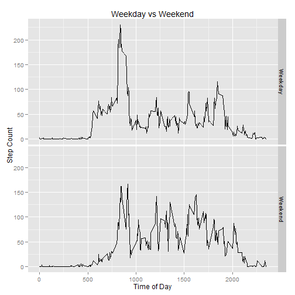

# Reproducible Research: Peer Assessment 1
========================================================

It is now possible to collect a large amount of data about personal movement using activity monitoring devices.  In this analysis we are going to invetigate a few key questions regarding the activity monitor of an anonymous participant during the months of October and November.

The data for this analysis is part of this repository, in the file **activity.zip**.

The variables included in this dataset are:

* steps: Number of steps taking in a 5-minute interval (missing values are coded as NA)
* date: The date on which the measurement was taken in YYYY-MM-DD format
* interval: Identifier for the 5-minute interval in which measurement was taken

The dataset is stored in a comma-separated-value (CSV) file and there are a total of 17,568 observations in this dataset

## Loading and preprocessing the data

* Unzip the data if it is present in the working directory, 
* read it in, 
* and handle the date column and NAs. 

```r
    zipFileName <- "activity.zip"
    if (file.exists(zipFileName)){
        files <- unzip(zipFileName, overwrite = TRUE)
    } else {
        stop(paste0("Required file '", zipFileName, "' not found in current working directory."))
    }

    activityData <- read.csv(files[1])
    activityData$date <- as.Date.character(activityData$date)
    activityDataNoNas <- na.omit(activityData)
```

## What is mean total number of steps taken per day?

* Create a histogram of the total number of steps taken each day.
* Get one value for the mean of steps in a day across the entire dataset
* Do the same for the median value

```r
library(ggplot2)
library(plyr)
totalStepsPerDay <- ddply(activityDataNoNas,.(date), summarize, daySteps=sum(steps))

dayStepHist <- ggplot(totalStepsPerDay, aes(x=date, weight=daySteps))
dayStepHist + geom_histogram(binwidth=1)
```

 

```r
stepsMean <- mean(totalStepsPerDay$daySteps)
stepsMedian <- median(totalStepsPerDay$daySteps)
```

The mean of the steps in a day across the two months of the dataset is **1.0766 &times; 10<sup>4</sup>** and the median is **10765**.


## What is the average daily activity pattern?
* Make a time series plot, showing step count by time of day using the values avaeraged across the two months
* Report the time interval that, on average, has the highest step count

```r
avgByTimeInterval <- ddply(activityDataNoNas, .(interval), summarize, intervalAvg=mean(steps))


ggplot(avgByTimeInterval, aes(x=interval, y=intervalAvg)) +
    geom_line() +
    labs(x = "Time of Day", y="Step Count") +
    ggtitle("Time Series of Step count, Averaged Across Entire Dataset") 
```

 

```r
    sortedAvgStepsByTimeInterval <- arrange(avgByTimeInterval, desc(intervalAvg))
    maxOfAverageIntervals <- sortedAvgStepsByTimeInterval[1,"interval"]
```
The 5-minute interval, on average across all the days in the dataset, that contains the maximum number of steps is **835**.

## Imputing missing values
* Report the count of NAs in the dataset.
* Create an identical dataset that replaces NA values -- replace the NAs with that interval's average from the entire dataset
* Create a histogram like the one from earlier in the analysis, this time illustrating the data with the NAs replaced
* Report whether the substitution approach had an impact on the mean and median values.


```r
#count the NAs
naOccurence <- is.na(activityData$steps)
naCount <- sum(naOccurence)

#copy the dataset for preservation
activityDataNaFix <- activityData

#adjust the steps column to contain the actual step counts where original
#contained values and replace the NAs with interval averages obtained earlier
activityDataNaFix <- join(activityDataNaFix, avgByTimeInterval, by="interval")
activityDataNaFix[is.na(activityDataNaFix$steps),"steps"] <- activityDataNaFix[is.na(activityDataNaFix$steps),"intervalAvg"]
activityDataNaFix <- activityDataNaFix[,1:3]


totalStepsPerDayNaFix <- ddply(activityDataNaFix,.(date), summarize, daySteps=sum(steps))
dayStepHist <- ggplot(totalStepsPerDayNaFix, aes(x=date, weight=daySteps))
dayStepHist + geom_histogram(binwidth=1)
```

 

```r
stepsMeanNaFix <- mean(totalStepsPerDayNaFix$daySteps)
stepsMedianNaFix <- median(totalStepsPerDayNaFix$daySteps)
```

The number of NAs in the input dataset is **2304**.

The values calculated earlier where the NAs were ommitted are:  
mean:   **1.0766 &times; 10<sup>4</sup>**   
median: **10765**  

Substituting in the the interval average for NAs results in:  
mean:   **1.0766 &times; 10<sup>4</sup>**   
median: **1.0766 &times; 10<sup>4</sup>**  

The substitution approach did not have a significant impact.

## Are there differences in activity patterns between weekdays and weekends?

```r
activityDataNaFix[weekdays(activityDataNaFix$date) %in% c("Saturday","Sunday"),"dayType"] <- "Weekend"

activityDataNaFix[!(weekdays(activityDataNaFix$date) %in% c("Saturday","Sunday")),"dayType"] <- "Weekday"


totalStepsPerDay <- ddply(activityDataNaFix,.(dayType, interval), summarize, intervalAvg=mean(steps))

qplot(interval, intervalAvg, data=totalStepsPerDay, facets=dayType~., geom="line",
      ylab="Step Count", xlab="Time of Day", main = "Weekday vs Weekend")
```

 
